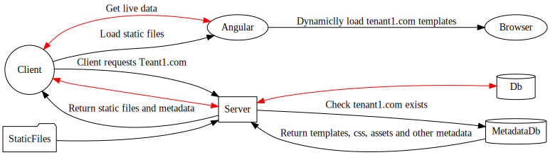

# Holodeck

Tenant based dynamic templating for Angular SPA's using .NET

1. Client Requests tenant1.com
2. Server requests tenant1.com from MetadatDb
3. MetadatDb returns all metadata
4. Server packages static files (Angular) and metadata together sending it all back to the client  
5. Client loads static files starting Angular
6. Angular boots showing first paint with essential assets
7. Angular pulls in and renders templates plus all extra assets

